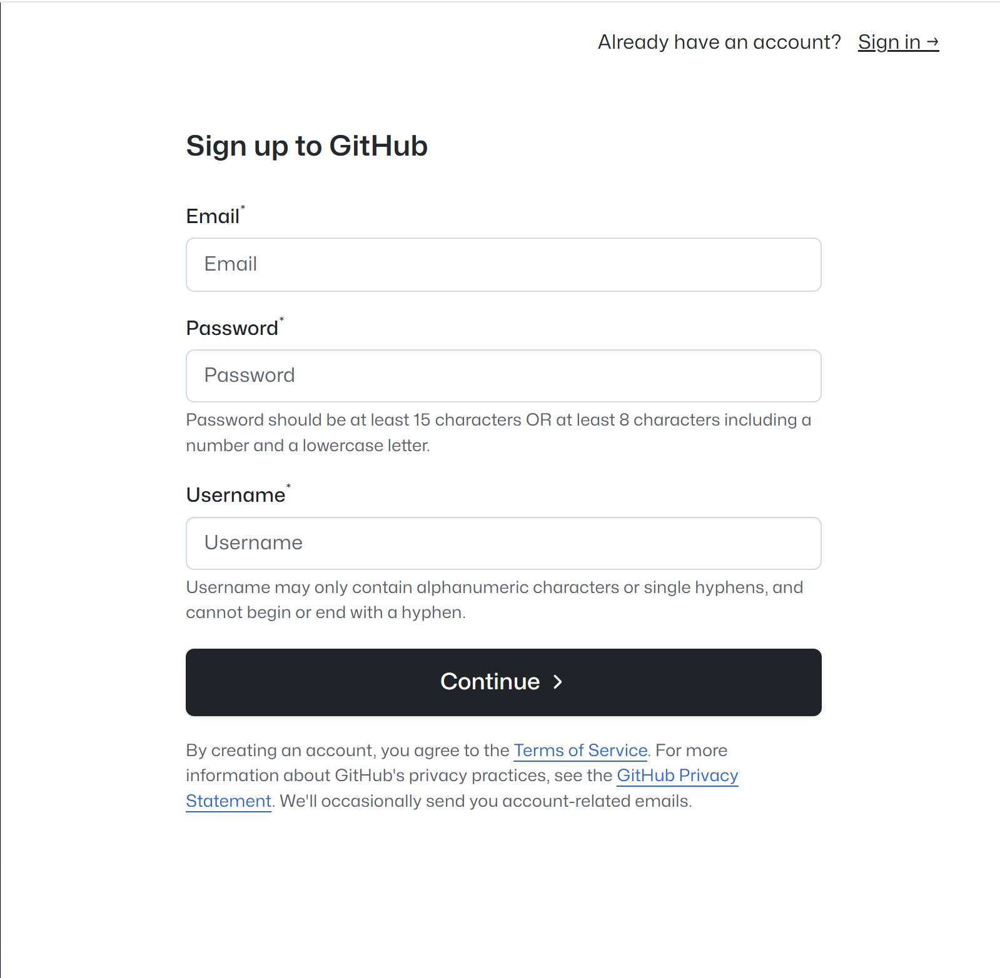
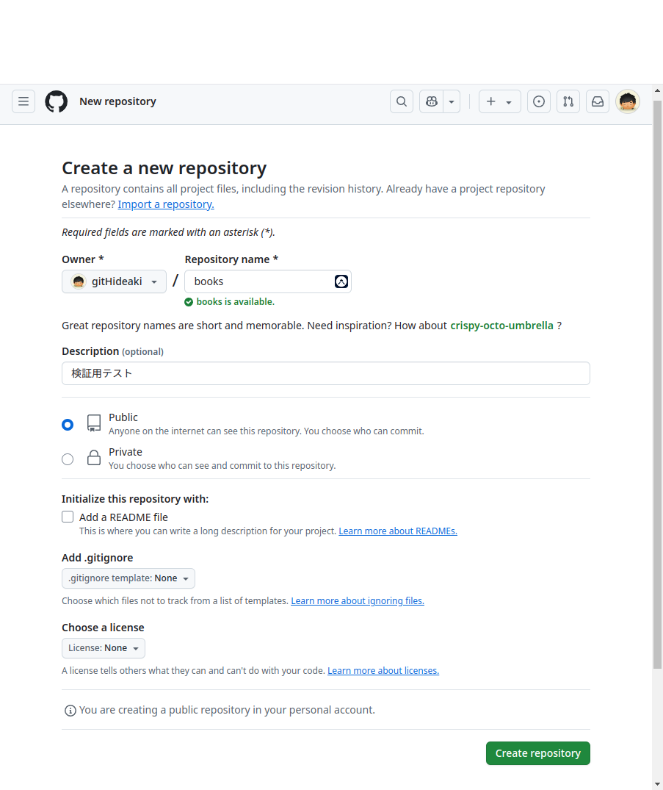

<!-- 
_backgroundColor: black
_color: white
_class: title
-->

# とりあえずさわってみる

論より手を動かせ！

---
<!-- 
_backgroundColor: black
_color: white
-->

# 注意事項

<!-- _class: center-slide -->
ここで説明するコマンドは基本Windows向けになります。
bash/Powershell共通コマンドであればbash側に合わせていますが、そうでない場合はPowershellのコマンドで説明しています。


---
<!-- _class: subTitle-->
# gitの環境準備

まずgitのコマンドを使えるようにしましょう。

---
# Windowsでのインストール方法

## wingetというパッケージ管理ツールを利用します！

コマンドプロンプトかpowershellを開き

~~~powershell
# インストールコマンド
> winget install git.git

# バージョン確認
> git -v
git version 2.48.1.windows.1
~~~

---

# Windowsでのインストール方法

改めて管理者権限でPowershellを開きposh-gitをインストールします。

~~~powershell
# posh-gitモジュールのインストール
Set-ExecutionPolicy -ExecutionPolicy RemoteSigned
Install-Module posh-git -Scope CurrentUser -Force

# posh-gitをPowershellを起動させた際に読み込むようにプロファイルに設定
Write-Output "Import-Module posh-git" | Out-File $PROFILE -Append
~~~

<div class="box green">

## bosh-gitってなに？

Powershellでgitを管理する際便利なツール。コマンドにtabが効く様になる他管理しているリポジトリの情報の表示が行えるようになります。
</div> 

---
# Macintoshでのインストール方法

ターミナルを開き

```bash
# インストールコマンド
% brew install git

# バージョン確認
% git -v
```

---
<!-- _class: subTitle-->

# GitHubへの登録

リモートリポジトリと言えばこれ！

---

# GitHubへのアクセス

https://github.com/
へアクセスし、Sign Upを実施


アカウントは個人メールを推奨します。



---

# ssh鍵の登録

## GitHubとssh鍵連携を行います。

ssh-keygenコマンドを利用しssh鍵を作成します。
```sh
# 都合上ホームディレクトリの.sshに移動して作業します。
cd ~/.ssh
# 鍵作成
ssh-keygen -t ed25519 -C "<登録メールアドレス>" -f "<任意の鍵名>"
# 出力例
Generating public/private ed25519 key pair.
Enter file in which to save the key (~/.ssh/id_ed25519): [Enterキー]
Enter passphrase (empty for no passphrase): [オプションでパスワード入力]
# パスワードは無くてもよい

# 公開鍵情報確認
cat "./<任意の鍵名>.pub"
ssh-ed25519 AAAAC3NzaC1lZDI1NTE5AAAAIEgu/syui3Uq//******************************* <メールアドレス>
# 公開鍵情報をGitHubに登録します。
```
---
<!-- _class: auto-scaling -->
# ssh鍵の登録

## GitHubにSSH鍵を登録

1. GitHubにログインし、右上のプロフィールアイコンをクリック
2. 「Settings（設定）」 を開く
3. 左メニューから 「SSH and GPG keys」 を選択
4. 「New SSH key」 をクリック
5. Title に分かりやすい名前を入力（例: "My Laptop SSH Key"）
6. Key に先ほどコピーした公開鍵を貼り付け
7. 「Add SSH key」 をクリックして登録


---
# ssh鍵の登録

## 連携したSSH鍵でgithubにアクセスできるようにする。

githubに接続する時はこの鍵を使うということをデバイスに覚えさせます！

```powershell
cd ~/.ssh

# github.comにアクセスするときは作成した鍵を使うようにconfig作成
$content = @"
Host github
  Hostname github.com
  User git
  IdentityFile ~/.ssh/id_ed25519
"@
$utf8NoBom = New-Object System.Text.UTF8Encoding $false
[System.IO.File]::WriteAllText("$HOME\.ssh\config", $content, $utf8NoBom)

# githubへ接続確認
ssh -T github
Hi <githubユーザー名> You've successfully authenticated, but GitHub does not provide shell access.
# successfullyと言われればOK

```

---
# ssh鍵の登録
<div class="box green">

## 🔑 GitHubでSSH鍵を設定すると何がいいの？
githubとの連携を行う方法としてhttps&トークン または ssh鍵交換による設定が可能です。ssh鍵を利用することで以下メリットがあります。


1. パスワードなしでの安全な認証
   - 毎回パスワードを入力せずに、git push や git pull を実行できる。
   - パスワード認証よりも安全で、自動化スクリプトなどにも便利。
2. HTTPSよりも利便性が高い
   - HTTPSではパーソナルアクセストークン（PAT）が必要だが、SSHならキーを設定するだけでOK。
   - 公開鍵と秘密鍵の仕組みで認証するため、認証情報が直接ネットワークを流れることがない。
3. サーバーやCI/CD環境との連携が容易
   - SSH鍵を使えば、サーバーやCI/CDツールとスムーズにリポジトリをやり取りできる。
</div>

---
<!-- _class: center-slide -->
# ssh鍵の登録

## GitHub連携完了！

---
<!-- _class: subTitle-->
# ローカル環境の準備

最初のgit操作の第一歩

---

# ローカル環境の準備

## gitへ自己紹介しましょう。

GitHubに登録したユーザーアカウント情報をローカルにも登録
コマンドのユーザー名、メールアドレスは例です。

```bash
git config --global user.name "itc git-like"​
git config --global user.email "git-like@itc-tokyo.co.jp"
```

ここで登録した情報を元にgitの操作が行われていきます。

---

# ローカル環境の準備

## はじめてみよう
gitリポジトリを作成してみます。

```bash
mkdir books​
cd books​
git init
```

<div class="box green">

## 🤔リポジトリって何？
バージョン管理するための貯蔵庫のことです​。ここではbooksディレクトリ内のファイルに対してバージョン管理を行える様に調整している形になります。
</div>

---
# ローカル環境の準備

## 状態の確認

現在のリポジトリの状態を確認しましょう。

```bash
git status
On branch master

No commits yet

nothing to commit (create/copy files and use "git add" to track)
```

これはまだ何も変更が加わっていないということを示しています。

---
# ファイルの追加

とりあえず0byteのテキストファイルでも作ってみてどうなるか見てみよう

```powershell
New-Item test.txt
```

```bash
git status
On branch master

No commits yet

Untracked files:
  (use "git add <file>..." to include in what will be committed)
        test.txt

nothing added to commit but untracked files present (use "git add" to track)
```
`git add`してファイルを追跡できる様にしてねとのこと

---

# ファイルの追跡

`git add`して追加したファイルの変更を追跡しよう。

```bash
git add ./test.txt

git status
On branch master

No commits yet

Changes to be committed:
  (use "git rm --cached <file>..." to unstage)
        new file:   test.txt
```

gitで管理しているファイルにtest.txtが追加されました。
すべてまとめてaddするなら `git add *` とアスタリスクを使えばOK！
このコミットする前の管理スペースを**ステージングエリア**といいます。

---

# コミットしてみよう

ステージングエリアに置いたファイルをコミットします。

```bash
git commit -m “<コミットメッセージ>”
[master (root-commit) 5d4e6a8] “<コミットメッセージ>”
 1 file changed, 0 insertions(+), 0 deletions(-)
 create mode 100644 test.txt
```

<div class="box green">

## 😁コミットするとは？
コミットすると作成、変更したファイルの状態のメッセージと合わせる形でスナップショットとして保存します。
そのため、コミットした瞬間の状態に戻すことが可能になります。

また変更箇所も前回のコミットとの差分として全て確認が容易になり、誰が、どのデータをどのタイミングで追加、削除、変更したのか変更履歴として追うことも容易に可能です。
そのため、コミットメッセージは何を行ったコミットか分かりやすく登録することが基本になります。
</div>

---

# ローカルの操作の流れ


---
# ローカルの操作の流れ


---
# ローカルの操作の流れ


---
# 操作の歴史を追いましょう

コミットを繰り返してgitへ変更の履歴の保存ができることが分かりました。
ムムム！たくさんコミットしてどんな作業をしたか思い出せない…

そんなときは`git log`で歴史を振り返ることができます。

```bash
git log
commit 5d4e6a88b995f86d3eae6aa31ec89893682860a7 (HEAD -> master)
Author: "<作業者名>"
Date:   Tue Mar 11 15:54:30 2025 +0900

    "<コミットメッセージ>"
```

---
<!-- _class: subTitle-->

# リモートリポジトリの利用

GitHubとローカルの環境を同期させる

---
# リモートリポジトリの利用

ローカル環境の準備が終わったので今度は登録したGitHubでベアリポジトリを作成します。

ここでは現在のコミット状態を共有を行います。ここから他の人も保存したデータを引っ張ってこれるようになります。

> https://github.com/new

<div class="box green">

## リモートリポジトリとGitHubの違いは？
GitHubはリモートリポジトリの一つです。クラウドサービスとして利用できる他のサービスとしては他にGitLab、BitBucketが有名です。
またオンプレでリモートリポジトリサーバーを構築することも可能です。こちらはGitLabが無料でサービス提供していたりします。

</div>

---

# GitHub上のリポジトリ作成

作成時点で見ておきたい項目

| 項目              | 内容                   | 
| ----------------- | ---------------------- | 
| Repository name   | 作成するリポジトリ名   | 
| Description       | リポジトリの説明(任意) | 
| Public or Private | 公開するか非公開か     | 

とは言えリポジトリ名以外はあまり深く考える必要はなかったりします。



---

# ローカル環境との連携

リモートリポジトリをローカル環境に認識させます。

```bash
# 登録コマンド
git remote add origin git@github.com:<your account>/<リポジトリ名>.git
# 確認コマンド
git remote -v
origin  git@github.com:<your account>/<リポジトリ名>.git (fetch)
origin  git@github.com:<your account>/<リポジトリ名>.git (push)
```
これでローカルのbooksディレクトリのgitがリモートリポジトリの場所を認識できました。

---
# ブランチ名の変更
ブランチって何？とは思うと思いますが、今は一旦以下の通りコマンド実行をしてください。

```bash
git branch -m main
```
<div class="box green">

## mainとmaster
posh-gitを利用していると解ると思いますがプロンプトの表示が `[master]>` から `[main]>` に変わったかと思います。
これはローカルの現在のブランチ名を`master`から`main`に変更したため変わったという意味になります。

ブランチに関しては次の章で詳しく説明します。
</div>


---
# リモートリポジトリへ変更点の共有

変更を上げるコマンドは以下の通りです。
```bash
git push -u origin main
```

| オプション   | 内容                         | 
| -------------| ----------------------       | 
| -u           | リモートブランチの自動追跡   | 
| origin       | remote add したときの名前    | 
| main         | デフォルトのブランチ名       | 

ブラウザを更新してGitHub上で何が変わったか確認しましょう。

---
<!-- _class: center-slide -->

## ローカルとリモート環境が使えるようになった！


---
<!-- _class: subTitle -->

# 共同開発はじめました！
別人の気持ちで先程のファイルを編集します。


---

# GitHubのリポジトリ複製

別人の気持ち…ということで一旦booksディレクトリから離れたところに移動して先程のリポジトリをGitHubから取り込みます。

```bash
cd ..
git clone git@github.com:<アカウント名>/<リポジトリ名y>.git alt_books
```

これで`alt_books`という名前でリポジトリを複製することができました。

いやいやさっきと同じアカウントが使われるじゃないか！
って思いますよね…えぇその通りです😅

別人の気持ちって言っていますが、同一人物が違うPCで作業するためにデータ取り込んで開発するとかそんなイメージですね。
本当は別PCならssh鍵の設定から始めるんですが、そこは気にしない方向で

---

# 変更を加える

alt_booksでファイルを追加します。

```powershell
New-Item alt_test.txt
git add alt_test.txt
git commit -m "add alt_test.txt"
git push
```

pushしたらgithubで状態の確認をしましょう。
alt_test.txtファイルが追加されたはずです。

---

# 変更の取り込み

booksディレクトリ側で最新の情報を取り込みます。

```powershell
cd ../books
git pull
```
ファイルの確認もしておきます。
```powershell
Get-ChildItem


    ディレクトリ: C:\Users\<ユーザー名>\books


Mode                 LastWriteTime         Length Name
----                 -------------         ------ ----
-a----        2025/03/15     10:43              0 alt_test.txt
-a----        2025/03/12     17:05              0 test.txt
```


booksディレクトリ側に最新の状態が取り込まれました。

---

# ファイルそのものの変更確認
test.txtになんでもいいのでテキストを追加して保存します。
その際にどのような変更が加えられているのか確認します。

```powershell
# 【例】
# testって文言追加
Write-Output "test" | Out-File .\test.txt -Append -Encoding utf8

# 変更点の確認
git diff
diff --git a/test.txt b/test.txt
index e69de29..a13c399 100644
--- a/test.txt
+++ b/test.txt
@@ -0,0 +1 @@
+ test

```

`+ test` の部分が追加された変更です。
ファイルが削除されたり、テキストの修正の場合は消えた箇所が`-`で表示されます。

---

# 変更確認 Part2

`git add` 後にステージングエリアに置かれたファイルについては単純な `git diff` コマンドでは変更点は分かりません。
`-- staged` オプションが必要になります。

```bash
git add test.txt
git diff
# 何も表示されない
git diff --staged
diff --git a/test.txt b/test.txt
index e69de29..a13c399 100644
--- a/test.txt
+++ b/test.txt
@@ -0,0 +1 @@
+ test
```

---

# 変更の取り消し

## git addの取り消し

`git add` した後のファイルを取り消す場合は　`git reset` コマンドを使います。

```bash
git reset test.txt
```

`git reset` は状態を前に戻すためのコマンドです。

addの取り消しはファイル自体には変更が加えられている形ですが、今度はファイルそのものを最後のコミットの状態まで戻す方法を紹介します。

```bash
git checkout -- text.txt
```

注意としてはコミットしていない変更は消える為、最後のコミットに認識を間違えると戻りすぎたりします。
慣れたときにやりがち…

---

# ブランチを切る

共同作業の中で誤った変更が本番環境に加えられると大事故です！
そこでいままで作業していたmainブランチから新しく作業用のブランチを用意してそちらで変更を行っていきます。新たなブランチを用意することを「ブランチを切る(cut a branch)」と表現します。

ここでは今まで加えた変更を削除するclean_upブランチを切ります。

```bash
# ブランチ確認
git branch
* main

# clean_upブランチを切ります。
git branch clean_up

# ブランチ確認
git branch
  clean_up
* main
```

ブランチ切ったけど今はまだmainブランチにいるのが分かります。

---

# ブランチの切り替え

clean_upブランチに切り替えます。

```bash
# ブランチ切り替え
git checkout clean_up
Switched to branch 'clean_up'
# ブランチ確認
git branch
* clean_up
  main
```
clean_upブランチに切り替わったことは`*`がついているかどうかで判断可能です。

<div class="box green">

## ブランチ作成と切り替えを同時に行う方法
以下コマンドで可能です。

git checkout -b <ブランチ名>

基本的にはこちらの方がよく使われるかと思います。

</div>

---

# ファイルの削除

`git rm`コマンドでファイルの削除が可能です。通常のGUIやコマンドでファイル削除してももちろんOKですが、このコマンドで削除した場合は削除した情報をそのままステージングに登録します。
`git add`を省く形ですね。

```bash
# ファイル削除 + git add
git rm "*.txt"

# コミット
git commit -m "Remove all text files"
```

---

# ブランチの変更取り込み

clean_upブランチで行った作業をmainブランチに取り込みます。

```bash
# mainブランチへの切り替え
git checkout main

# clean_upブランチの変更取り込み
git merge clean_up

# 確認
git log
```

不要となったブランチは削除しましょう。

```bash
git branch -d clean_up

# ブランチ確認
git branch
```

---

# GitHubにご報告

最後にGitHubにも変更結果を反映させます。

```bash
git push
```

この一連の流れでgitを利用する形になっていきます。

---
<!-- _class: center-slide -->

## <!-- fit -->Gitが使える！！
✌('ω'✌ )三✌('ω')✌三( ✌’ω')✌
